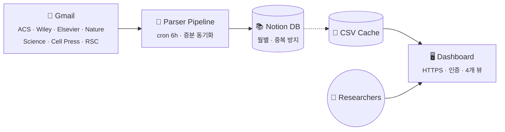
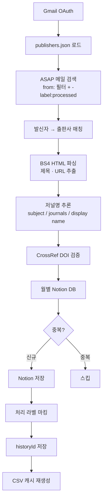
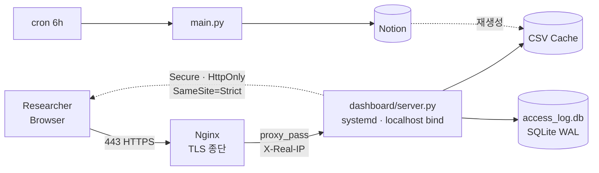

# get-ASAP

> **Gmail ASAP 알림 → Notion 자동 저장 → 브라우저 대시보드**
> 촉매·에너지 분야 연구자가 매일 쏟아지는 신규 논문을 놓치지 않기 위한 엔드투엔드 자동화.

Python으로 7개 출판사 · 60+ 저널의 ASAP 메일을 파싱하고, Notion을 Single Source of Truth로 쓰며, Tailwind + Chart.js 대시보드로 가시화합니다.

---

## 한 눈에 보기



매 6시간 cron이 Gmail을 읽어 출판사별 파서로 논문을 추출하고, 중복 체크 후 Notion에 저장합니다. 대시보드는 Notion을 캐시 CSV로 받아 시각화.

---

## 주요 기능

### 수집
- **플러그인 파서 구조** · `parsers/` 디렉토리에 파일 추가만으로 새 출판사 자동 등록
- **Gmail historyId 증분 동기화** · 중복 실행에 안전, 재처리 없음
- **CrossRef DOI 검증** · 제목 유사도 + publisher prefix 일치성으로 오배정 차단
- **Notion 저장 재시도** · 타임아웃 / 5xx 발생 시 지수 백오프로 자동 복구

### 대시보드 (4개 뷰)
- **Home** · KPI 5종, 전역 검색, 최근 논문, 연구실 맞춤 포커스
- **Analytics** · Keyword Trends, Word Cloud, Journal×Keyword Matrix, User Interest
- **Browse** · 저널별 / 주제별 × 날짜 그룹, 저널 내부 검색
- **Stats** (관리자 전용) · 접속 로그, 피드백 트리아지

### 운영
- **HTTPS** · DuckDNS + Let's Encrypt (certbot 자동 갱신)
- **Reverse proxy** · Nginx → 로컬 바인드 Python 서버로 격리 · X-Real-IP 전달
- **다중 사용자 bcrypt 인증** · 계정별 섹션 가시성·맞춤 포커스 서버 제어
- **systemd + ThreadingHTTPServer** · 크래시 자동 복구, 동시 요청 처리
- **SQLite WAL 모드** · reader-writer 동시성 보장

---

## Quick Start

```bash
git clone https://github.com/hydrochan/get-ASAP.git && cd get-ASAP
python -m venv .venv && source .venv/bin/activate
pip install -r requirements.txt
cp .env.example .env          # NOTION_TOKEN 등 입력
python get_token_curl.py      # Gmail OAuth 1회
python main.py --dry-run      # 파싱만 테스트
python main.py                # 실제 실행
python dashboard/server.py    # 대시보드 로컬 실행
```

---

## Tech Stack

| 층위 | 선택 |
|---|---|
| **언어/런타임** | Python 3.11+ |
| **외부 API** | Gmail API · Notion API · CrossRef |
| **파싱** | BeautifulSoup4 + lxml |
| **대시보드** | Tailwind · Chart.js · wordcloud2.js (정적 SPA) |
| **서버** | ThreadingHTTPServer · systemd |
| **인프라** | Nginx · Let's Encrypt · DuckDNS · Oracle Cloud Ubuntu |
| **저장소** | Notion (SSOT) · SQLite (WAL) · CSV (캐시) |

---

<details>
<summary><b>🔍 파이프라인 흐름 (자세히)</b></summary>



주요 안전장치
- `state.json` · 마지막 처리 historyId 저장 → 증분 동기화 기준점
- `get-ASAP-processed` 라벨 · 재처리 방지 이중 안전장치
- Notion 제목 equals query · 동일 논문 재저장 차단
- 네트워크 예외 재시도 · `_is_duplicate`는 1·2·4·8·16초 백오프 (5회)
</details>

<details>
<summary><b>🏗️ 프로덕션 아키텍처</b></summary>



**보안 계층**
- Python 서버는 localhost 에만 바인드 · iptables + 클라우드 Security List 로 외부 차단
- Nginx가 유일한 진입점 · 433만 허용
- 쿠키: `HttpOnly` + `SameSite=Strict` + HTTPS 감지 시 `Secure` 조건부 부여
- 브루트포스: IP 기반 20회/2분 잠금 (NAT 공유 환경 대응)
- 사용자별 설정은 `.env` `DASHBOARD_USER_PROFILES` JSON으로 서버만 소유 — 프론트엔드에 계정명 노출 X
</details>

<details>
<summary><b>➕ 새 출판사 / 저널 추가</b></summary>

**같은 출판사에 새 저널** · `publishers.json` 한 줄만 추가
```json
"journals": ["Angewandte Chemie", "Advanced Materials", "NEW JOURNAL"]
```

**새 출판사 추가** (3단계)
1. `publishers.json`에 sender / journals / doi_prefix 등록
2. `parsers/` 에 파서 파일 생성 · `BaseParser` 상속
3. 끝 · `parser_registry`가 자동 디스커버리
</details>

<details>
<summary><b>🛠️ 환경변수</b></summary>

| 변수 | 필수 | 설명 |
|---|---|---|
| `NOTION_TOKEN` | ✓ | Notion Integration Token |
| `NOTION_PARENT_PAGE_ID` | ✓ | 월별 DB 자동 생성 부모 페이지 |
| `DASHBOARD_USERS` | ✓ | `{"user":"bcrypt_hash"}` JSON |
| `DASHBOARD_ADMINS` | ✓ | 관리자 username (쉼표 구분) |
| `DASHBOARD_USER_PROFILES` | | 사용자별 숨김 섹션 · 포커스 프로필 매핑 (JSON) |
| `GMAIL_CREDENTIALS_PATH` | | 기본 `credentials.json` |
| `GMAIL_TOKEN_PATH` | | 기본 `token.json` |
</details>

<details>
<summary><b>🚀 배포 명령</b></summary>

```bash
# 서비스 제어
sudo systemctl status get-asap-dashboard
sudo systemctl restart get-asap-dashboard
journalctl -u get-asap-dashboard -f

# 수동 파이프라인
.venv/bin/python main.py

# bcrypt 해시 생성
.venv/bin/python -c "import bcrypt; print(bcrypt.hashpw(b'PASSWORD', bcrypt.gensalt()).decode())"

# 인증서 갱신 테스트
sudo certbot renew --dry-run
```
</details>

---

<sub>MIT License</sub>
