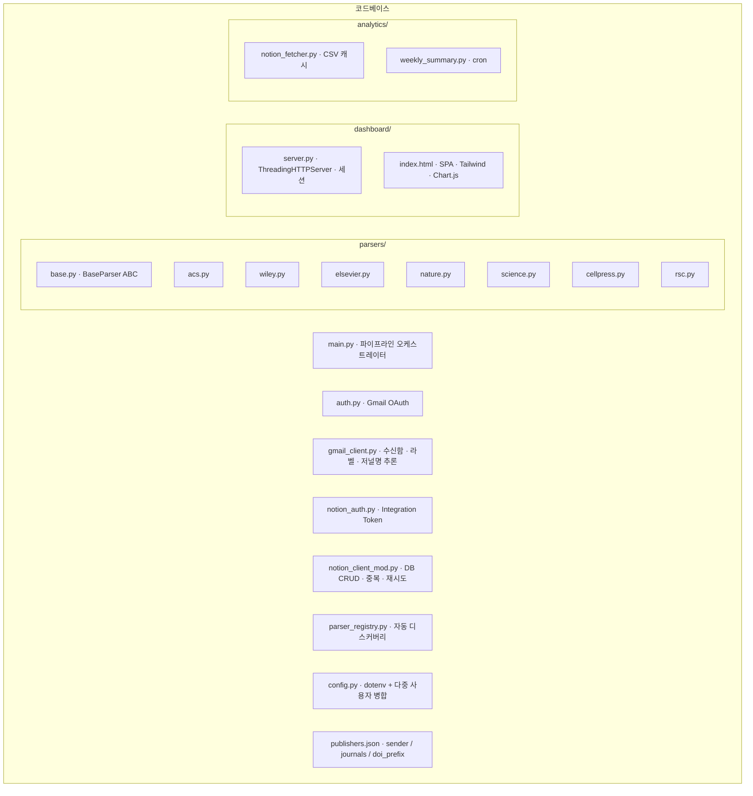
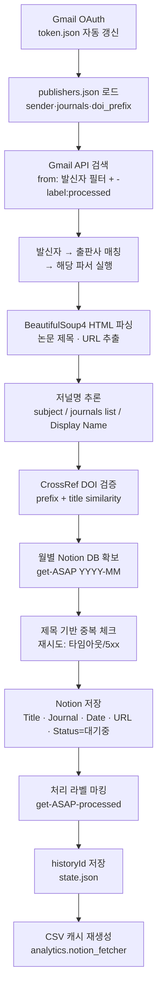
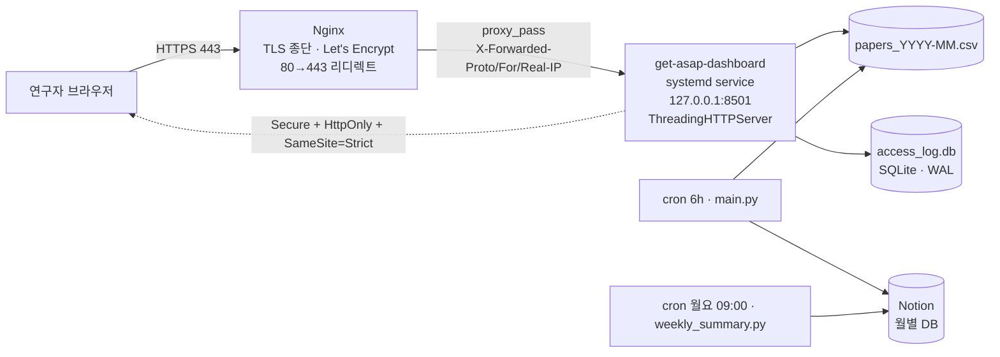

# get-ASAP

촉매·에너지 분야 연구자가 최신 논문을 놓치지 않도록, Gmail에 도착하는 학술 저널 ASAP(As Soon As Published) 알림 메일을 자동 수집해 Notion DB에 저장하고, 브라우저 대시보드로 시각화하는 엔드투엔드 파이프라인.

**🚀 2026.04.17 KIST 수소연구단 정식 배포 · 30+ 연구원 동시 사용**

Live: https://***REDACTED-DOMAIN***

---

## System Overview

```mermaid
flowchart LR
    subgraph PUB["출판사 ASAP 메일"]
        ACS[ACS]
        WIL[Wiley]
        ELS[Elsevier]
        NAT[Nature]
        SCI[Science]
        CEL[Cell Press]
        RSC[RSC]
    end
    PUB -->|OAuth 2.0| GM[Gmail 수신함]

    subgraph PIPE["수집 파이프라인 (cron 6h)"]
        P1[parser_registry<br/>자동 디스커버리]
        P2[BeautifulSoup4<br/>HTML 파싱]
        P3[저널명/날짜 추론<br/>publishers.json]
        P4[중복 방지<br/>Notion query]
    end
    GM -->|historyId 증분| PIPE

    subgraph STORE["Notion · SSOT"]
        MD1[(get-ASAP 2026-04)]
        MD2[(get-ASAP 2026-05)]
        MD3[(Weekly Summary DB)]
    end
    PIPE --> MD1

    subgraph CACHE["CSV 캐시"]
        CSV[papers_YYYY-MM.csv]
    end
    MD1 -.->|"cron 재생성"| CSV

    subgraph DASH["대시보드 (HTTPS SPA)"]
        D1[Home · KPI · Focus · Search]
        D2[Analytics · Charts · Heatmap]
        D3[Browse · 저널/주제 × 날짜]
        D4[Stats · 관리자 전용]
    end
    CSV --> DASH
    DASH -.->|"login / page_view / feedback"| LOG[(access_log.db<br/>SQLite · WAL)]

    USER[연구원 30+] -->|HTTPS| DASH
```



---

## Features

### 1. 수집 파이프라인
- **7개 출판사 · 60+ 저널** 지원: ACS, Wiley, Elsevier, Nature, Science, Cell Press, RSC
- **플러그인 파서**: `parsers/`에 파일 추가만으로 새 출판사 등록 (자동 디스커버리)
- **증분 동기화**: Gmail historyId 기반으로 새 메일만 처리 (중복 실행 안전)
- **중복 방지**: 제목 기반 Notion query로 동일 논문 재저장 차단
- **월별 DB 자동 생성**: `get-ASAP YYYY-MM` 구조로 아카이브 분리
- **DOI 검증**: CrossRef API로 prefix 일치성 확인 → 엉뚱한 DOI 배제
- **재시도 로직**: Notion API 타임아웃/5xx 발생 시 exponential backoff로 자동 복구 (최대 5회)

### 2. 대시보드 (Tailwind + Chart.js SPA)
- **Home**: KPI 5종 · 🧪 사용자 맞춤 포커스 · 🔍 전역 검색 · Paper Count · Recent Papers
- **Analytics**: Keyword Trends · Word Cloud · Top Keywords Tree · Journal Frequency · Journal×Keyword Heatmap · User Interest Analysis
- **Browse**: By Journal / By Topic 계층 리스트 × 날짜 그룹, 상세 뷰 내부 검색
- **Stats** (관리자 전용): 로그인/페이지뷰 KPI · 사용자별 집계 · 일별 차트 · 📮 User Feedback 트리아지
- **리포트 다운로드**: 모달에서 기간·섹션·키워드·논문 수 선택 → Markdown 생성

### 3. 보안 / 운영
- **HTTPS**: DuckDNS + Let's Encrypt (certbot 자동 갱신)
- **Nginx reverse proxy**: 127.0.0.1:8501로 격리, X-Forwarded-Proto 전달
- **다중 사용자 bcrypt 인증**: 관리자 / 연구실 / 학교 계정 분리
- **브루트포스 잠금**: IP 기반 20회/2분 (NAT 공유 환경 고려)
- **섹션 가시성 제어**: 사용자별로 개인 관심 데이터 자동 숨김
- **systemd 서비스**: `Restart=always`, `ThreadingHTTPServer`로 크래시 자동 복구
- **SQLite WAL 모드**: reader-writer 동시성 보장 (30명 규모 무리 없음)
- **접속 로그**: X-Real-IP 파싱으로 실제 클라이언트 IP 확보

---

## Architecture



## Pipeline Flow (cron 매 6시간)



## Production Stack (2026.04 —)



---

## Quick Start

```bash
# 1. 클론 & 설치
git clone https://github.com/hydrochan/get-ASAP.git
cd get-ASAP
python -m venv .venv
source .venv/bin/activate  # Windows: .venv\Scripts\activate
pip install -r requirements.txt

# 2. 환경변수 설정
cp .env.example .env
# NOTION_TOKEN, NOTION_PARENT_PAGE_ID, DASHBOARD_USERS 등 입력

# 3. Gmail OAuth 인증 (최초 1회)
python get_token_curl.py      # 로컬 SSL 이슈 회피용 curl 방식

# 4. 파이프라인 실행
python main.py --dry-run       # 테스트 (Notion 저장 X)
python main.py                 # 실제 실행

# 5. 대시보드 로컬 실행
python dashboard/server.py --port 8501
# → http://127.0.0.1:8501
```

---

## Adding a New Publisher

기존 출판사의 **새 저널**은 `publishers.json`의 `journals` 배열에 추가:

```json
"journals": ["Angewandte Chemie", "Advanced Materials", "NEW JOURNAL"]
```

**새 출판사** 추가 절차 (3단계):

1. `publishers.json`에 sender / journals / doi_prefix 등록
2. `parsers/` 에 파서 파일 생성 — `BaseParser` 상속 후 `can_parse()`, `parse()` 구현
3. 재시작 시 `parser_registry`가 자동 등록 — 코드 수정 불필요

---

## Tech Stack

| Component | Technology |
|-----------|-----------|
| Runtime | Python 3.11+ |
| Gmail API | google-api-python-client + google-auth-oauthlib |
| Notion API | notion-client 3.0 + httpx (직접 query) |
| HTML Parsing | BeautifulSoup4 + lxml |
| DOI Verify | CrossRef API |
| Dashboard | Tailwind CSS + Chart.js + wordcloud2.js (정적 SPA) |
| Server | ThreadingHTTPServer + systemd |
| Reverse Proxy | Nginx + Let's Encrypt |
| Auth | bcrypt + session cookie (HttpOnly/SameSite/Secure) |
| Logs DB | SQLite (WAL 모드) |
| Scheduling | cron (Ubuntu, Oracle Cloud) |

---

## Environment Variables

| Variable | Required | Description |
|----------|----------|-------------|
| `NOTION_TOKEN` | ✓ | Notion Integration Token |
| `NOTION_PARENT_PAGE_ID` | ✓ | 월별 DB 자동 생성 부모 페이지 |
| `DASHBOARD_USERS` | ✓ | `{"user":"bcrypt_hash", ...}` JSON |
| `DASHBOARD_ADMINS` | ✓ | 관리자 username (쉼표 구분) |
| `GMAIL_CREDENTIALS_PATH` | | OAuth credentials (기본: credentials.json) |
| `GMAIL_TOKEN_PATH` | | OAuth token (기본: token.json) |

---

## Operations

```bash
# 서비스 제어
sudo systemctl status get-asap-dashboard
sudo systemctl restart get-asap-dashboard
journalctl -u get-asap-dashboard -f

# 수동 파이프라인 실행
.venv/bin/python main.py

# bcrypt 해시 생성
.venv/bin/python -c "import bcrypt; print(bcrypt.hashpw(b'PASSWORD', bcrypt.gensalt()).decode())"

# 인증서 갱신 테스트
sudo certbot renew --dry-run
```

---

## License

MIT
