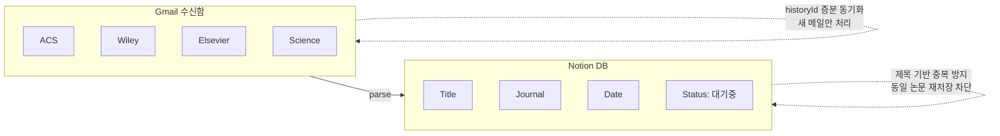
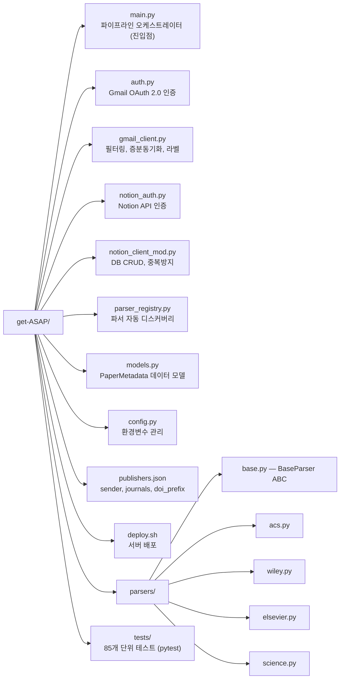
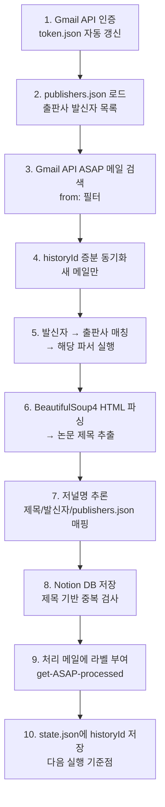

# get-ASAP

Gmail에서 학술 저널 ASAP(As Soon As Published) 알림 메일을 자동으로 감지하여 논문 제목을 추출하고, Notion 데이터베이스에 저장하는 자동화 파이프라인.

## Overview



## Features

- **4개 출판사 지원**: ACS, Wiley, Elsevier, Science/Science Advances
- **플러그인 파서**: `parsers/` 디렉토리에 파일 추가만으로 새 출판사 등록
- **증분 동기화**: Gmail historyId 기반으로 새 메일만 처리 (중복 실행 안전)
- **Notion 자동 저장**: 논문 제목 + 저널명 + 상태("대기중") 자동 저장
- **중복 방지**: 제목 기반 중복 검사로 동일 논문 재저장 차단
- **cron 자동화**: 오라클 클라우드 Ubuntu에서 6시간 간격 자동 실행
- **로깅**: `logs/get-asap.log` 에 실행 결과 기록 (RotatingFileHandler)

## Quick Start

```bash
# 1. 클론 & 설치
git clone https://github.com/hydrochan/get-ASAP.git
cd get-ASAP
python -m venv .venv
source .venv/bin/activate  # Windows: .venv\Scripts\activate
pip install -r requirements.txt

# 2. 환경변수 설정
cp .env.example .env
# .env 파일에 NOTION_TOKEN, NOTION_DATABASE_ID 등 입력

# 3. Gmail OAuth 인증 (최초 1회)
python -c "from auth import get_gmail_service; get_gmail_service()"
# 브라우저에서 Google 계정 인증 → token.json 자동 생성

# 4. 실행
python main.py --dry-run --verbose  # 테스트 (Notion 저장 없이)
python main.py                      # 실제 실행
```

## Usage

```bash
python main.py                # 전체 파이프라인 실행
python main.py --dry-run      # Notion 저장 없이 파싱 결과만 출력
python main.py --verbose      # DEBUG 레벨 로그 활성화
```

## Architecture



## Pipeline Flow



## Adding a New Publisher

기존 출판사(ACS, Wiley 등)의 **새 저널**은 `publishers.json`의 `journals` 배열에 이름만 추가:

```json
"journals": ["Angewandte Chemie", "Advanced Materials", "NEW JOURNAL NAME"]
```

**새 출판사**는 3단계:

1. `publishers.json`에 항목 추가
2. `parsers/` 에 파서 파일 생성 (`BaseParser` 상속)
3. 자동 등록 완료 (코드 수정 불필요)

## Server Deployment

```bash
# 오라클 클라우드 Ubuntu
git clone https://github.com/hydrochan/get-ASAP.git
cd get-ASAP
bash deploy.sh

# .env, token.json, credentials.json은 SCP로 별도 전송
scp .env token.json credentials.json ubuntu@SERVER:~/get-ASAP/

# cron 등록 (매 6시간)
crontab -e
# 0 */6 * * * cd /home/ubuntu/get-ASAP && .venv/bin/python main.py >> logs/cron.log 2>&1
```

## Tech Stack

| Component | Technology |
|-----------|-----------|
| Runtime | Python 3.11+ |
| Gmail API | google-api-python-client + google-auth-oauthlib |
| Notion API | notion-client 3.0.0 |
| HTML Parsing | BeautifulSoup4 + lxml |
| Testing | pytest (85 tests) |
| Deployment | Oracle Cloud Ubuntu + cron |
| Config | python-dotenv + .env |

## Environment Variables

| Variable | Required | Description |
|----------|----------|-------------|
| `NOTION_TOKEN` | Yes | Notion Integration Token |
| `NOTION_DATABASE_ID` | Yes* | 기존 Notion DB ID |
| `NOTION_PARENT_PAGE_ID` | Yes* | DB 신규 생성 시 부모 페이지 ID |
| `GMAIL_CREDENTIALS_PATH` | No | OAuth credentials 경로 (기본: credentials.json) |
| `GMAIL_TOKEN_PATH` | No | OAuth token 경로 (기본: token.json) |
| `CHECK_INTERVAL_HOURS` | No | 실행 간격 (기본: 6) |

*`NOTION_DATABASE_ID` 또는 `NOTION_PARENT_PAGE_ID` 중 하나 필수

## License

MIT
